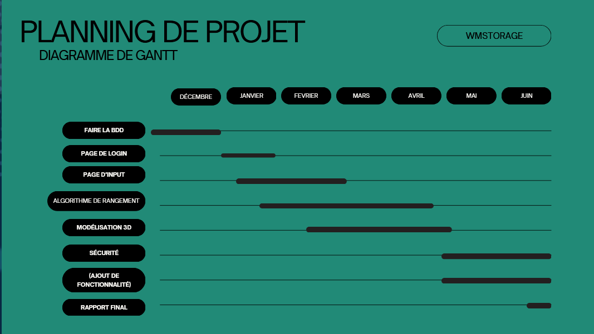
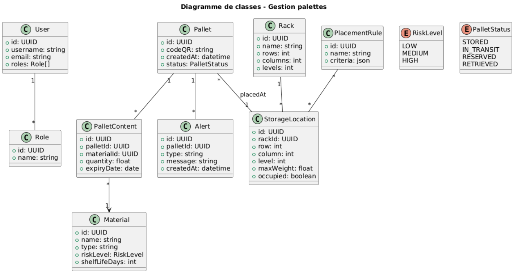
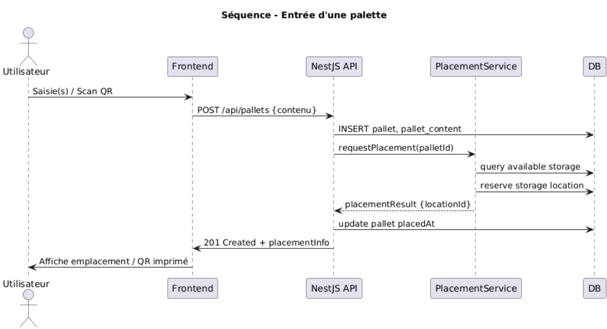
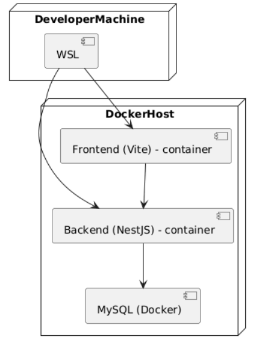
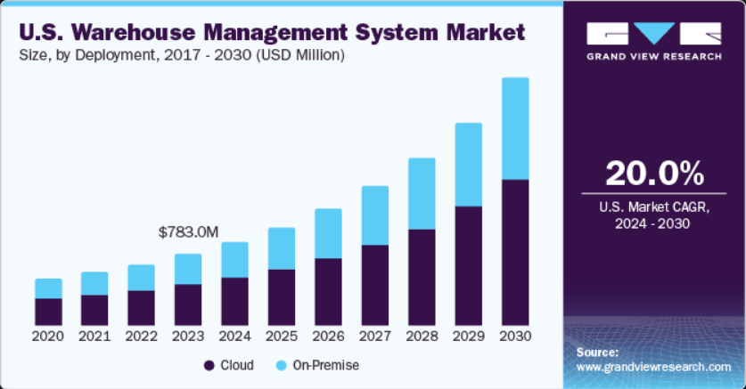

# ERP Gestion d’entrée/sortie & Rangement de palettes

---

## 1. Résumé exécutif

Objectif : concevoir un ERP pour gérer les entrées, le rangement, la visualisation 3D et les sorties de palettes de matériaux en entrepôt, avec prise en compte des matériaux à risque et des dates de péremption.

Stack technique proposée :

* Backend : NestJS (TypeScript) + Swagger
* Frontend : React (Vite + TypeScript) + Material UI
* DB : MySQL (Docker)

---

### 1.1 Planning



## 2. UML

> Les diagrammes ci‑dessous sont au format PlantUML

### 2.1 Diagramme de classes

<!--```plantuml
@startuml
title Diagramme de classes - Gestion palettes

class User {
  +id: UUID
  +username: string
  +email: string
  +roles: Role[]
}

class Role {
  +id: UUID
  +name: string
}

class Material {
  +id: UUID
  +name: string
  +type: string
  +riskLevel: RiskLevel
  +shelfLifeDays: int
}

class Pallet {
  +id: UUID
  +codeQR: string
  +createdAt: datetime
  +status: PalletStatus
}

class PalletContent {
  +id: UUID
  +palletId: UUID
  +materialId: UUID
  +quantity: float
  +expiryDate: date
}

class Rack {
  +id: UUID
  +name: string
  +rows: int
  +columns: int
  +levels: int
}

class StorageLocation {
  +id: UUID
  +rackId: UUID
  +row: int
  +column: int
  +level: int
  +maxWeight: float
  +occupied: boolean
}

class PlacementRule {
  +id: UUID
  +name: string
  +criteria: json
}

class Alert {
  +id: UUID
  +palletId: UUID
  +type: string
  +message: string
  +createdAt: datetime
}

User "1" -- "*" Role
Pallet "1" -- "*" PalletContent
PalletContent "*" - -> "1" Material
Rack "1" -- "*" StorageLocation
Pallet "*" -- "1" StorageLocation : placedAt
Pallet "1" -- "*" Alert
PlacementRule "*" -- "*" StorageLocation

enum RiskLevel {
  LOW
  MEDIUM
  HIGH
}

enum PalletStatus {
  STORED
  IN_TRANSIT
  RESERVED
  RETRIEVED
}

@enduml
``` -->


*Fichier : `uml_schema_palette.png` — diagramme UML du schéma de gestion des palettes.*
---

### 2.2 Diagramme de séquence : Entrée d'une palette
<!-- 
```plantuml
@startuml
title Séquence - Entrée d'une palette
actor Utilisateur
participant Frontend
participant API as "NestJS API"
participant PlacementService
participant DB

Utilisateur -> Frontend: Saisie(s) / Scan QR
Frontend -> API: POST /api/pallets {contenu}
API -> DB: INSERT pallet, pallet_content
API -> PlacementService: requestPlacement(palletId)
PlacementService -> DB: query available storage
PlacementService -> DB: reserve storage location
PlacementService - -> API: placementResult {locationId}
API -> DB: update pallet placedAt
API -> Frontend: 201 Created + placementInfo
Frontend -> Utilisateur: Affiche emplacement / QR imprimé

@enduml
``` -->


---

### 2.3 Diagramme de déploiement (simple)

<!-- ```plantuml
@startuml
node DeveloperMachine {
  component "WSL" as wsl
}

node DockerHost {
  component "MySQL (Docker)" as mysql
  component "Backend (NestJS) - container" as backend
  component "Frontend (Vite) - container" as frontend
}

wsl - -> backend
wsl - -> frontend
backend - -> mysql
frontend - -> backend

@enduml
``` -->

---

## 3. Cahier des charges

### 3.1 Contexte

On souhaite créer un ERP pour gérer l'arrivée, le stockage, la surveillance (dates & risques) et la sortie de palettes dans des entrepôts afin d'améliorer traçabilité, sécurité et productivité.

### 3.2 Objectifs

* Automatiser l’affectation des palettes vers des emplacements sûrs.
* Rendre visible l’état du stock en 3D pour faciliter les opérations.
* Alerter avant péremption et en cas de risque.
* Permettre des retraits guidés et sûrs.

### 3.3 Périmètre fonctionnel

1. **Paramétrage**

   * Gestion utilisateurs / rôles / permissions
   * Configuration des racks, emplacements, règles de placement, types de matériaux, niveaux de risque

2. **Entrée palettes**

   * Saisie manuelle ou scan QR
   * Gestion du contenu (matériaux, quantités, dates)
   * Proposition d’emplacement automatique + possibilité de choisir manuellement

3. **Stock & Visualisation**

   * Visualisation 3D des racks et états (libre/occupé)
   * Détails d’une palette (contenu, dates, warnings)

4. **Sortie palettes**

   * Recherche et filtrage
   * Indication d’emplacement précis
   * Processus de retrait avec vérifications (risque, date)

5. **Alerting & Reporting**

   * Alertes configurables (ex : Alerte J-30 avant péremption)
   * Rapports de mouvements, alerte, occupation

6. **Administration & API**

   * API Swagger pour tests et intégration
   * Logs et audit

### 3.4 Exigences non fonctionnelles

* **Langage** : TypeScript partout
* **Interopérabilité** : API REST documentée (Swagger)
* **Accessibilité** : UI responsive (desktop & tablette)

### 3.5 Contraintes techniques

* Base MySQL via Docker
* TypeScript strict
* Tests unitaires & d’intégration (Jest)

### 3.6 Critères d'acceptation

* Feature `Entrée palette` : lorsqu’une palette est enregistrée, le système doit proposer un emplacement valide prenant en compte le niveau de risque et la charge du rack ; la palette doit être visible en 3D au même instant (données cohérentes).
* Feature `Alerte péremption` : notifications configurées, testées et reçues par utilisateur admin 30 jours avant date d’expiration.
* Feature `Retrait` : recherche par matériau renvoie la bonne palette et son emplacement précis; retirer marque l’emplacement libre et journalise l’opération.

### 3.7 Livrables

* Multi repo ( frontend, backend)
* README général et scripts Docker
* Documentation API Swagger
* Diagrammes UML et schéma DB
* Manuel d’exploitation (déploiement Docker, backups MySQL)
* Tests unitaires & quelques tests de bout-en-bout

### 3.8 Risques & plan de mitigation

* **Complexité 3D** → MVP 3D minimal (représentation cubique) puis enrichissement.
* **Règles de placement métier** → prévoir feature flags et override manuel.
* **Performance DB (grand entrepôt)** → indices, partitionnement, cache (Redis si nécessaire).

## 4. Annexes utiles

### 4.1 Schéma DB (simplifié)

Tables principales : `users`, `roles`, `materials`, `pallets`, `pallet_contents`, `racks`, `storage_locations`, `placement_rules`, `alerts`, `audit_logs`.

Exemple d'indexation :

* index on `storage_locations(occupied)`
* index on `pallets(status)`
* composite index on `pallet_contents(materialId, expiryDate)`

## 5. Etat de l'art

Les WMS modernes gèrent la putaway (rangement palette), le slotting algorithmique, contraintes physiques (hauteur/charge) et la traçabilité GS1/RFID ; ils peuvent être intégrés à un ERP ou déployés en SaaS.
La tendance forte est le cloud/SaaS, la séparation WMS↔WES pour piloter automates (AS/RS, AMR) et l’usage d’IA/ML pour optimiser le slotting et prévoir le flux.
Les risques projet : modélisation physique insuffisante (hauteurs/emplacements), customisations excessives et mauvaise roadmap WMS↔WES. Favoriser pilote sur une zone et configuration plutôt que heavy dev.

### Concurrents pertinents:
Blue Yonder / Manhattan (JDA / Manhattan Associates) — leaders WMS pour grands DC et 3PL. 

SAP EWM (Embedded / Cloud) — pour intégration forte ERP → entrepôt. 

Oracle Warehouse Management Cloud — WMS cloud orienté enterprise. 

Körber (HighJump) — WMS adaptable, présence forte EMEA/SMB→entreprise. 

Infor / Manhattan Associates (segment enterprise & retail). 

Dematic — WMS + intégration forte AS/RS & automation. 

Generix Group (France / Europe) — WMS SaaS & réseaux logistiques (fort en France). 

Hardis (Reflex WMS) — acteur français pour entrepôts complexes / omnicanal. 

Softeon / Tecsys — spécialistes WMS/mid-market avec capacités palettisation et distribution.

